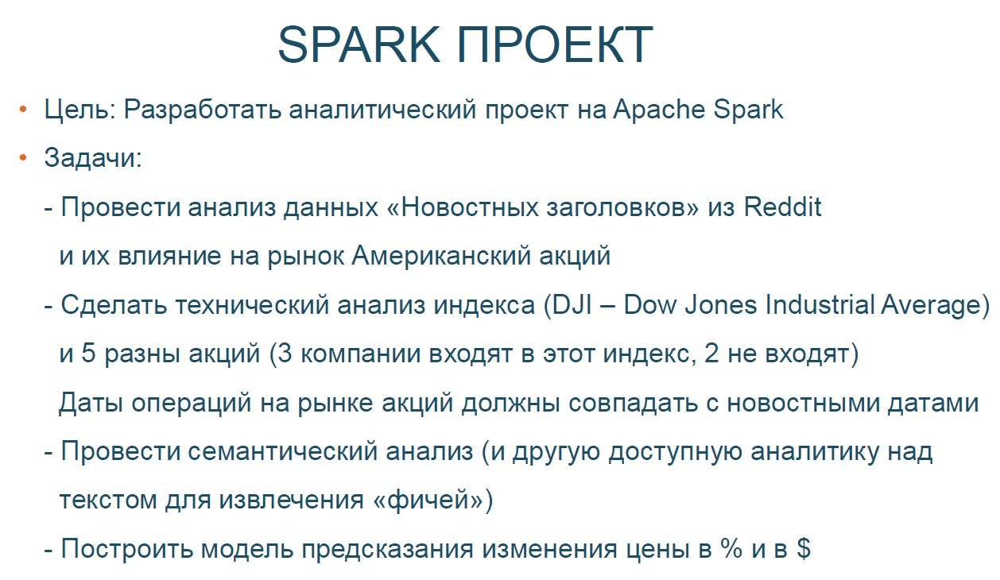
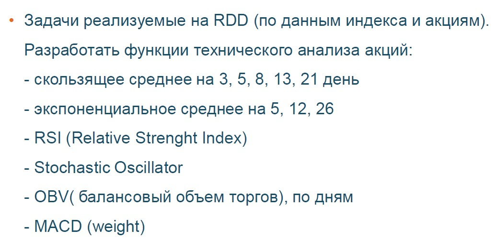

# hse_spark_course

## Cодержание
- [MapReduce. Введение в распределенные вычисления](#t1)
- [Apache Spark. RDD](#t2)
- [Финальный проект](#finpro)

## Инфраструктура курса

- [Локальный кластре на Docker](https://github.com/NameArtem/hadoop-spark-standalone-docker)
- [DataBricks Community](/tutorials/databricks_tutorial)

## План курса

|№|Тема занятия| Статус| Дата | Ссылка|
|:---:|:---:|:---:|:---:|:---:|
|1| MapReduce. Введение в распределенные вычисления |Готово |27.02.2021||
|2| HDFS. Apache Spark (RDD) (+ FuncProg на Python) |Готово |06.03.2021||
|3| Spark SQL. Анализ больших данных |Готово (загрузить)|13.03.2021||
|4| Подробнее о модели вычислений Spark. Знакомство со Scala |Готово (загрузить)|20.03.2021||
|5| Spark ML |Готово (загрузить)|27.03.2021||
|6| Рекомендательные системы на Spark |Готово (загрузить)|03.04.2021||
|7| Spark Structure Streaming (+ интеграция со Spark ML) |Готово (загрузить)|10.04.2021||
|8| Модели в прод. Управленеи кластеровм  |Готово (загрузить)|17.04.2021||

## MapReduce. Введение в распределенные вычисления

[презентация](https://github.com/NameArtem/hse_spark_course/tree/master/pres)

[учебный материал](https://github.com/NameArtem/hse_spark_course/tree/master/classwork/d1)

[домашнее задание](https://github.com/NameArtem/hse_spark_course/tree/master/homework/hw_1)

## Apache Spark. RDD

[презентация](https://github.com/NameArtem/hse_spark_course/tree/master/pres)

[учебный материал](https://github.com/NameArtem/hse_spark_course/tree/master/classwork/d2)

## Финальный проект

[данные](https://github.com/NameArtem/hse_spark_course/tree/master/project/data)

