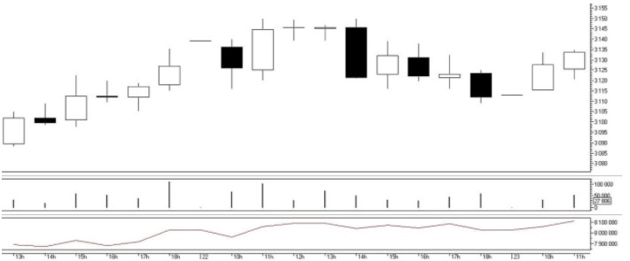
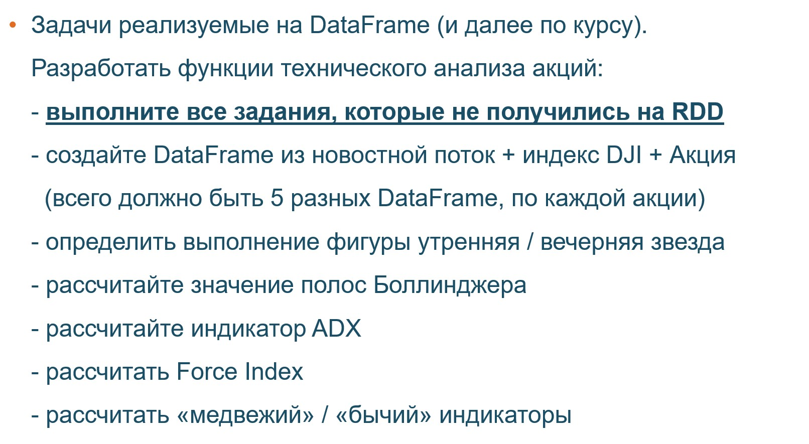
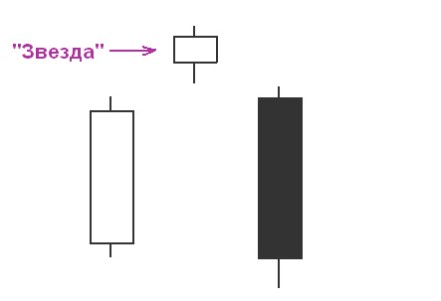
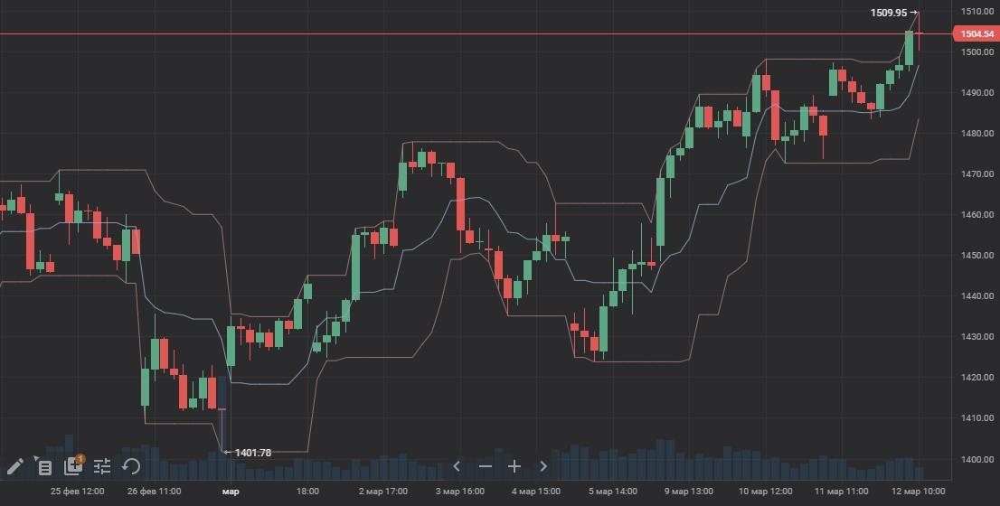
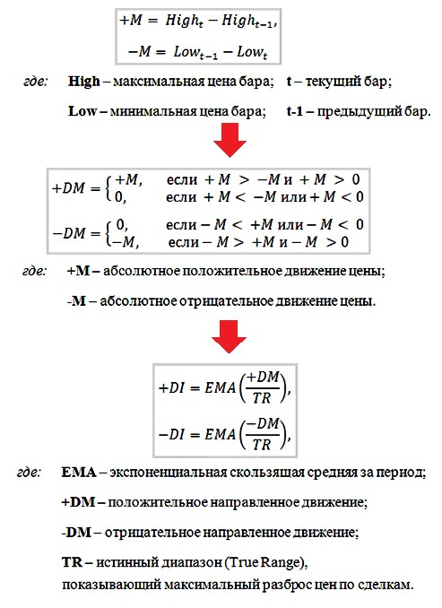
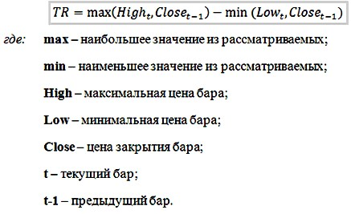
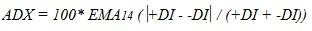
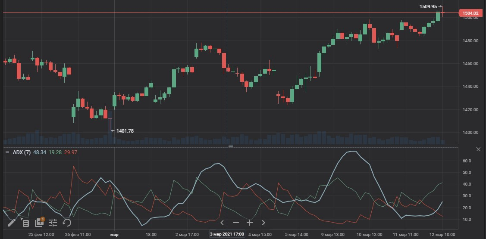
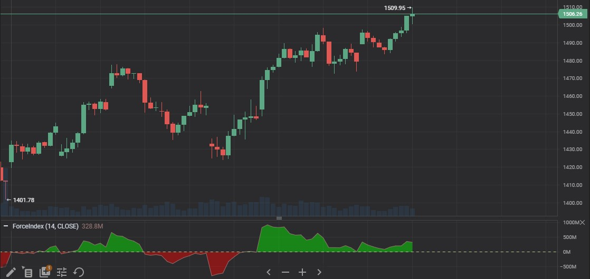

# hse_spark_course

## Cодержание
- [MapReduce. Введение в распределенные вычисления](#t1)
- [Apache Spark. RDD](#t2)
- [Apache Spark. DataFrame](#t3)
- [Финальный проект](#finpro)


## Инфраструктура курса

- [Локальный кластре на Docker](https://github.com/NameArtem/hadoop-spark-standalone-docker)
- [DataBricks Community](/tutorials/databricks_tutorial)

## План курса

|№|Тема занятия| Статус| Дата | Ссылка|
|:---:|:---:|:---:|:---:|:---:|
|1| MapReduce. Введение в распределенные вычисления |Готово |27.02.2021||
|2| HDFS. Apache Spark (RDD) (+ FuncProg на Python) |Готово |06.03.2021||
|3| Spark SQL. Анализ больших данных |Готово |13.03.2021||
|4| Подробнее о модели вычислений Spark. Знакомство со Scala |Готово (загрузить)|20.03.2021||
|5| Spark ML |Готово (загрузить)|27.03.2021||
|6| Рекомендательные системы на Spark |Готово (загрузить)|03.04.2021||
|7| Spark Structure Streaming (+ интеграция со Spark ML) |Готово (загрузить)|10.04.2021||
|8| Модели в прод. Управленеи кластеровм  |Готово (загрузить)|17.04.2021||


## MapReduce. Введение в распределенные вычисления
<a href='t1'></a>

[презентация](https://github.com/NameArtem/hse_spark_course/tree/master/pres)

[учебный материал](https://github.com/NameArtem/hse_spark_course/tree/master/classwork/d1)

[домашнее задание](https://github.com/NameArtem/hse_spark_course/tree/master/homework/hw_1)


## Apache Spark. RDD
<a href='t2'></a>

[презентация](https://github.com/NameArtem/hse_spark_course/tree/master/pres)

[учебный материал](https://github.com/NameArtem/hse_spark_course/tree/master/classwork/d2)


## Apache Spark. DataFrame
<a href='t3'></a>

[презентация](https://github.com/NameArtem/hse_spark_course/tree/master/pres)

[учебный материал](https://github.com/NameArtem/hse_spark_course/tree/master/classwork/d3)


## Финальный проект
<a href='finpro'></a>


Данные для финального проекта:

- Заголовки новостей с Reddit ([данные](https://github.com/NameArtem/hse_spark_course/tree/master/project/data
- Скачать индекс [DJI](https://ru.investing.com/indices/us-30)
- Скачать данные по акциям (выбрать 3 любые компании) из состава индекса DJI([структура индекса](https://ru.wikipedia.org/wiki/%D0%9F%D1%80%D0%BE%D0%BC%D1%8B%D1%88%D0%BB%D0%B5%D0%BD%D0%BD%D1%8B%D0%B9_%D0%B8%D0%BD%D0%B4%D0%B5%D0%BA%D1%81_%D0%94%D0%BE%D1%83_%D0%94%D0%B6%D0%BE%D0%BD%D1%81%D0%B0))
- Скачать данные по акциям (выбрать 2 любые компании), которые не входят в индекс DJI


<p align="center"></p>

### Задачи реализуемые на RDD

<p align="center"></p>

**Подсказки**

1. Скользящее среднее (и экспоненциальное скользящее среднее). Это функция `sliding`, её нужно реализовать самостоятельно

```python
# создайте функцию, которая будет брать окно по данным
def window(xi, n):
  # n - это размер окна
  # xi - это кортеж из значения и индекса
  x, i = xi
  return [(i - offset, (i, x)) for offset in range(n)]

# примените к объекту RDD

new_rdd = rdd\
            .zipWithIndex()\ # добавляем индекс к объекту
            .flatMap(lambda xi: gen_window(xi, n))\ # создаем пары для окна
            .groupByKey()\ # создаем окно в данных
            .mapValues(lambda vals: [x for (i, x) in sorted(vals)])\ # применяем сортировку для исправления последовательности
            .sortByKey()\ # сортируем по ключу, чтобы согласовать с прошлым шагом
            .values()\
            .filter(lambda x: len(x) == n)) # удаляем лишнее

```
----------------------------------

2. Расчет RSI (индикатор, который измеряет соотношение восходящий и нисходящих движений, нормализованный от 0 до 100). **Как понимать:** Данный индикатор отображает «моментум» - скорость и амплитуду с которых изменяется движение цены; насколько сильно изменяется цена в сторону своего движения. Иными словами, индикатор RSI показывает силу тренда и вероятность его смены.

 - чем сильнее относительное движение цены вверх(больше суммарная длина зеленых свечей̆ за определённый̆ период), то тем ближе значение индикатора к 100;
 - чем сильнее относительное движение цены вниз(больше суммарная длина красных свечей̆ за определённый̆ период), то тем ближе значение индикатора к 0


```
# формула расчета
# Шаг 1
# RS = средняя цена положительного закрытия / средняя цена отрицательного закрытия    (за период, обычно 3, 12 bkb 50)

# Шаг 2
# RSI = 100 - 100 / (1 + RS)
```

**Note:** рассмотрите методы `mapPartitions`. [Документации](https://spark.apache.org/docs/2.1.0/api/python/pyspark.html?highlight=mappartitions#pyspark.RDD.mapPartitionsWithIndex)

```python
def func(iterator):
  return [x * 100 for x in iterator]

rdd = sc.parallelize([1, 2, 3, 4])

rdd.mapPartitions(func).collect()
```

----------------------------------
3. Расчет `стохастического осциллятора / stochastic oscillator` — индикатор технического анализа, который показывает положение текущей цены относительно диапазона цен за определенный период в прошлом. В %.

 Понимание:
 - индикатор к покупке, когда осциллятор (%K или %D) сначала опустится ниже определенного уровня (обычно 20), а затем поднимется выше него;
 - индикатор к продаже, когда осциллятор сначала поднимется выше определенного уровня (обычно 80), а потом опустится ниже него;
 - индикатор к покупке, если линия %K поднимается выше линии %D;
 - индикатор к продаже, если линия %K опускается ниже линии %D.

```
# формула расчета

# данные
# CLOSE — сегодняшняя цена закрытия;
# MIN (LOW (%K)) — наименьший минимум за число периодов %K;
# MAX (HIGH (%K)) — наибольший максимум за число периодов %K.
# Периоды %K. Это число единичных периодов, используемых для расчета стохастического осциллятора.
# Периоды замедления %K. Эта величина определяет степень внутренней сглаженности линии %K. Значение 1 дает быстрый стохастический осциллятор, а значение 3 — медленный. (устанавливайте его на основе скользящего среднего)
# Периоды %D. Это число единичных периодов, используемых для расчета скользящего среднего линии %K.
# Метод %D. Это метод сглаживания (экспоненциальный, простой, сглаженный или взвешенный), используемый при расчете %D. (у нас всегда экспоненциальный)


# %K = (CLOSE - MIN (LOW (%K))) / (MAX (HIGH (%K)) - MIN (LOW (%K))) * 100

```

----------------------------------
4. Расчет `On Balance Volume (OBV)` - трендовый индикатор, рассчитываемый по данным объема торгов. Считается, что если текущая цена закрытия периода выше, чем предыдущая, то объем прибавляется к значению индикатора On Balance Volume. Если текущая цена закрытия ниже предыдущей, то данные объема вычитаются из индикатора

 Чтобы понять, как рассчитывается значение On Balance Volume, следует отобразить график объема торгов (Volume) под графиком цены в форме гистограммы (график объема торгов выводится по умолчанию сразу вместе с ценовым графиком).

 В качестве примера рассмотрим рисунок:

 <p align="center"></p>

  Последняя свеча на нем является растущей, и цена ее закрытия находится выше закрытия предыдущей свечи, поэтому текущий объем торгов (27806) будет прибавлен к показателю On Balance Volume и логически зачислен к объемам быков, показывая, что они у руля. При этом линия OBV растет. Если закрытие ценовой свечи было бы ниже предыдущей, то указанный объем вычитался бы из показателя OBV и приписывался к объему медведей, показывая, что именно они доминируют в текущий момент. При этом линия OBV снижалась бы на указанное значение объема. А если бы текущее значение цены было равно предыдущему, то OBV оставался без изменений, показывая, что на рынке нет лидирующей группы. То есть если On Balance Volume растет, то доминируют быки, если снижается — лидируют медведи, если не изменяется — на рынке нет победителя, и цена стоит на месте.

  **растущая свеча** - цена закрытия больше цены открытия

  **падающая свеча** - цена закрытия ниже цены открытия (больше о свечах на [сайте Московской бирже](https://place.moex.com/useful/yaponskie-svechi-dlya-nachinayushih))

  Рассмотрим на реальном графике:

  <p align="center"></p>

 **! Note:** подумайте, как это рассчитать. В этом показателе нет плавающих окон, но вам нужно в rdd добавить дополнительные "колонки"

----------------------------------

5. Расчет `MACD / Moving Average Convergence/Divergence` — это индикатор, показывает не только усредненный консенсус масс, но и отражает согласованность долгосрочной и краткосрочной тенденций. Индикатор MACD представляет собой комбинацию из трех скользящих средних. Одна, более быстрая (отражает краткосрочную тенденцию), называется «линией MACD», другая, более медленная (отражает долгосрочную тенденцию), — «сигнальной линией MACD». Периоды - 12 и 26, для быстрого и медленного значения.

 Рассмотрим на реальном графике:

 <p align="center"></p>

 Для построения данного индикатора необходимо взять экспоненциальное скользящее среднее (ЕМА) от цен закрытия с периодом усреднения 12. После от тех же цен закрытия следует вычислить еще одну ЕМА с периодом усреднения 26. Следующий шаг — вычесть из 12 ЕМА (оно будет больше, чем 26, в растущем тренде и меньше — в падающем) 26 ЕМА. Собственно, начертание этой разницы и образует быструю линию MACD. Для начертания сигнальной линии MACD следует вычислить ЕМА с периодом усреднения 9 от линии MACD (полученной разницы между 12 и 26 ЕМА). Таким образом получается индикатор, представляющий из себя две линии, периодически переплетающиеся между собой. Как раз 12, 26 и 9 являются стандартными параметрами ЕМА для построения индикатора MACD.


 ### Задачи реализуемые на RDD

 <p align="center"></p>

 **Подсказки**

1. Фигуры утренняя и вечерняя звезда.  Свечная модель – это разворотная модель японских свечей, предвестник роста / падения рынка. То есть она, обычно, предвещает перелом тенденции с медвежьей на бычью или на оборот.

 `Утренняя звезда` - определяется последовательностью: свечка отрицательного закрытия, малая свечка и большая свеча положительная. Вам необходимо создать колонку, где бинарно (1 или 0) будет показано, является ли данный день окончанием фигуры или нет.

 <p align="center"></p>

 `Вечерняя звезда` - определяется последовательностью: свечка положительного закрытия, малая свечка и большая свеча отрицательного закрытия. Вам необходимо создать колонку, где бинарно (1 или 0) будет показано, является ли данный день окончанием фигуры или нет.

 <p align="center"></p>

----------------------------------

 2. `Индикаторов Боллинджера`. Идея полос Болинджера состоит в том, чтобы объединить в себе трендовый индикатор, индикатор волатильности и осциллятор. Полосы обозначают на графике направление и диапазон колебаний цены, с учетом тренда и волатильности, характерной для текущей фазы рынка. Графически индикатор представляет из себя три линии: скользящая средняя посередине, характеризующая основное направление движения, и две линии, ограничивающие график цены с обеих сторон и характеризующие его волатильность.

 Верхняя и нижняя линии — это та же скользящая средняя, но смещенная на несколько стандартных (среднеквадратичных) отклонений. Полосы сами регулируют свою ширину: она увеличивается, когда рынок неустойчив, например, во время публикации новостей, и уменьшается в более стабильные периоды. Таким образом индикатор реализует в себе функции осциллятора в более удобной форме, когда можно сразу на графике с учетом амплитуды колебаний оценить, в состоянии перекупленности или перепроданности находится инструмент.

 `Интервал` - рекомендуется использовать скользящее окно в 20 периодов, для центрального показателя. И в 13 и 24 для верхнего и нижнего показателя

 Основным правилом при построении линий Bollinger является следующее утверждение — около 5% цен должно находиться за пределами этих линий, а 95% внутри.

 Для расчета индикатора нужно получить следующие данные:
  - медиану
  - стандартное отклонение
  - скользящее среднее

 <p align="center"></p>

 ----------------------------------

  3. `ADX`- это комплексный индикатор, чтобы рассчитать, нужно разобрать, как строятся линии +DI и —DI, которые уже сами по себе являются прекрасными индикаторами направленности рынка. +DI это экспоненциальное скользящее среднее (в оригинале берется период 14) разности максимума цены предыдущего дня из максимума цены текущего дня, деленного на истинный диапазон (TR-true range). Для -DI расчет такой же, только вместо максимумов берутся минимумы цен.

 <p align="center"></p>

  Истинный диапазон демонстрирует максимальный разброс цен по сделкам начиная с закрытия предыдущего периода. Рассчитывается он следующим образом

 <p align="center"></p>

  Только теперь мы можем рассчитать сам индикатор

<p align="center"></p>

Пример визуализации

<p align="center"></p>


----------------------------------

 4. `Медвежий и бычий индикатор` - это простые индикаторы, которые рассчитываются на основе экспоненциальной средней (EMA) за 10 периодов (окно)

 Формулы:
  - бычий = максимальное значение - EMA
  - медвежий = минимальное значений - EMA

---------------------------------

5. `Индекс Force` - индикатор создан для того, чтобы определить силу давления на котировки покупателей и продавцов. Считается, что индекс является одним из лучших индикаторов, в которых скомбинированы показатели цены и объема в единую величину.

 Индекс силы рассчитывается как разность текущей (Pi) цены закрытия и предыдущей(Pi-1), умноженной на объем торгов в текущей свече (Volume) (в нашем случае дневной объем).

 Пример расчета:
 - Шаг 1. Считаем Raw Force Index = (Pi - Pi-1) * Volume
 - Шаг 2. Считаем Force index = EMA(Raw Force Index) (размер окна из чисел Фибоначчи, на ваш выбор)


<p align="center"></p>
