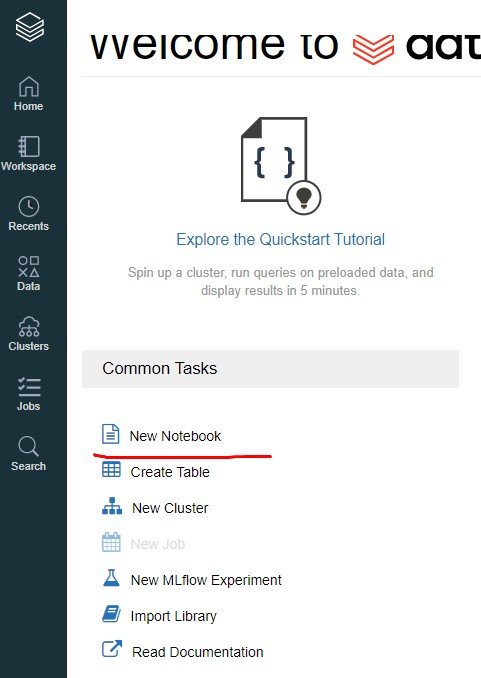

# Работа с DataBricks


## Содержание
- [Первый кластер](#first)
- [dbutils.fs](#dbutils)
- [Подключение сторонних источников](#others)


### Первый кластер
<a href='first'></a>

Необходимо пройти путь:
> Регистрация (Вход) - Clusters - Create Cluster - Выбрать нужные параметры - Установить Config / Переменные среды - Запустить кластер - использовать

1. Для создания кластера, необходимо перейти на сайт [DataBricks](https://community.cloud.databricks.com/) и пройти регистрациию.

2. Welcome страница DataBricks


3. Перейдите на вкладку Clusters


4. Выбрать `Create Cluster`


5. Установить нужные параметры: имя кластера, выбрать `DataBricks Runtime` (т.е. доступную среду)


6. Если необходимо, то вы можете указать Spark Config и переменные среды до запуска кластера


7. Запустите созданный кластер


8. Создайте Jupyter Notebook на кластере и начинайте использовать



-----------------------------------------------

### dbutils.fs
<a href='dbutils'></a>

>`dbutils.fs` позволяет работать с файловой системой (основной доступ к файлам ``/foo` равнозначен `dbfs:/foo`)

Доступны команды (равнозначны Linux/Hadoop):
- `dbutils.fs.help("methodName")` - получить описание метода
- `dbutils.fs.head("/file/path", maxBytes = 10000)` - показать первые строки файла
- `dbutils.fs.cp(from, to, recurse = false)` - копирование директории
- `dbutils.fs.mkdir(path/dir)` - создать директорию
- `dbutils.fs.put(file, contents, overwrite)` - загрузить данные
- `dbutils.fs.rm(path, recurse)` - удалить файл

</br>

Доступные команды для монтирования внешних хранилищ:
- `mount(source, mountPoint, encryptionType = "", owner = null, extraConfigs = Map.empty)` - монтирование в выбраную директорию DBFS
- `mount` - показать все директории в DBFS
- refreshMounts` - перезапустить кэш и переустановить все монтирования
- `unmount(mountPoint`) - удалить хранилище

--------------------------------------

#### Примеры команд

```python
# монитирование "transactions" хранилища
dbutils.fs.mount(
    source = f'abfss://transactions@{account_name}.dfs.core.windows.net/',
    mount_point = f'/mnt/transactions',
    extra_configs = configs)

# список всех директорий
display(dbutils.fs.ls('/mnt'))

# список всех директорий по определенному пути
display(dbutils.fs.ls('/mnt/transactions/2020'))
```

```python
# создание новой директории
dbutils.fs.mkdirs('/mnt/transactions/2020/p14')

# проверяем
display(dbutils.fs.ls('/mnt/transactions/2020'))

# удаляем директорию
dbutils.fs.rm('/mnt/transactions/2020/p14', recurse=True)
```

```python
# SQL query
jdbcHostname = '<server name>.database.windows.net'
jdbcDatabase = '<database name>'
userName = '<user name>'
password = '<password>'
jdbcPort = 1433
jdbcUrl = f'jdbc:sqlserver://{jdbcHostname}:{jdbcPort};database={jdbcDatabase};user={userName};password={password}'

df = spark.read.jdbc(url=jdbcUrl, table='<table name>')
display(df)
```
----------------------------------------------------------

### Подключение сторонних источников<
<a href='others'></a> 

Рассмотрим пример подключения сторонних источников на примере Azur.

Вам понадобится:
- [создать AD в Azur](https://docs.microsoft.com/en-us/azure/active-directory/develop/howto-create-service-principal-portal)
- получить application-id:
- получить directory-id
- получить storage-account-name
- получитьservice-credential
- зарегистрировать роль и пространство на the Azure Data Lake Storage Gen2 (или иметь туда аккаунт)

Используя [DataBricks CLI](https://docs.databricks.com/dev-tools/cli/index.html) установите переменные:
- `databricks secrets create-scope --scope Analysts`

- `databricks secrets put --scope Analysts --key SPID --string-value "Service Principal ID" (Application Client ID)`

- `databricks secrets put --scope Analysts --key SPKey --string-value "Service Principal Secret Key"`

- `databricks secrets put --scope Analysts --key DirectoryID --string-value "Azure Directory ID"`


Далее по шагам:

1. Смонтируйте
```
try:
  dbutils.fs.unmount('/mnt/ecovacs')
except:
  print()

try:
  dbutils.fs.unmount('/mnt/transactions')
except:
  print()

# сделайте настройки
client_id     = dbutils.secrets.get(scope='Analysts', key='SPID')
client_secret = dbutils.secrets.get(scope='Analysts', key='SPKey')
directory_id  = dbutils.secrets.get(scope='Analysts', key='DirectoryID')

# установите контейнер
account_name = 'storagejamesleslie'
container_name = 'ecovacs'

configs = {'fs.azure.account.auth.type': 'OAuth',
           'fs.azure.account.oauth.provider.type': 'org.apache.hadoop.fs.azurebfs.oauth2.ClientCredsTokenProvider',
           'fs.azure.account.oauth2.client.id': client_id,
           'fs.azure.account.oauth2.client.secret': client_secret,
           'fs.azure.account.oauth2.client.endpoint': f'https://login.microsoftonline.com/{directory_id}/oauth2/token'}

# сделайте монтирование
dbutils.fs.mount(
    source = f'abfss://{container_name}@{account_name}.dfs.core.windows.net/',
    mount_point = f'/mnt/{container_name}',
    extra_configs = configs)

display(dbutils.fs.ls(f'/mnt/{container_name}'))
```
